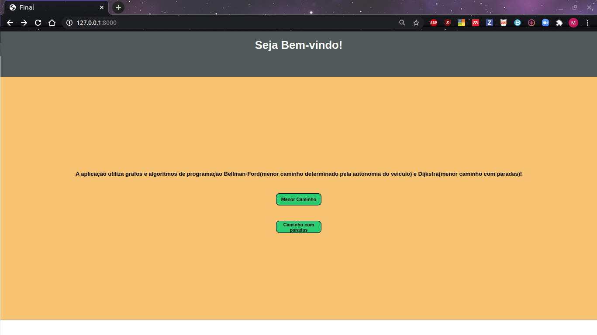
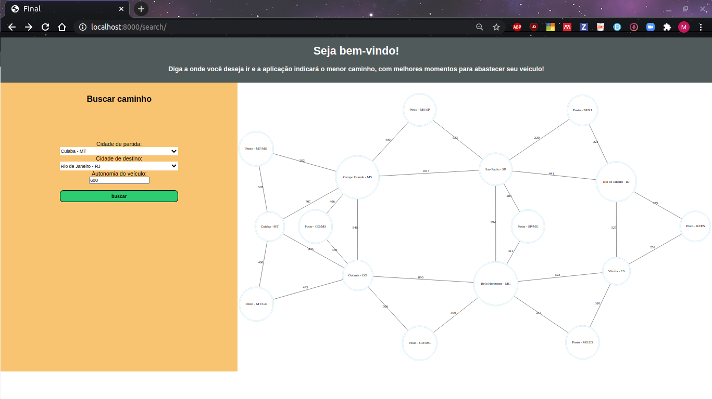
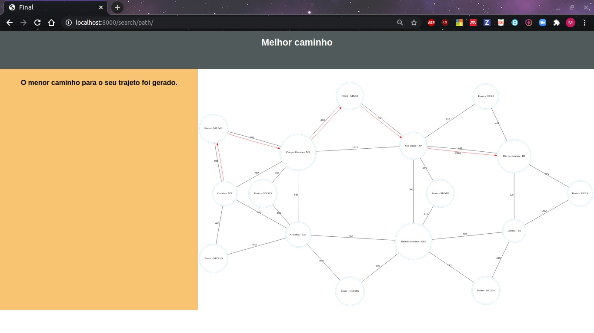
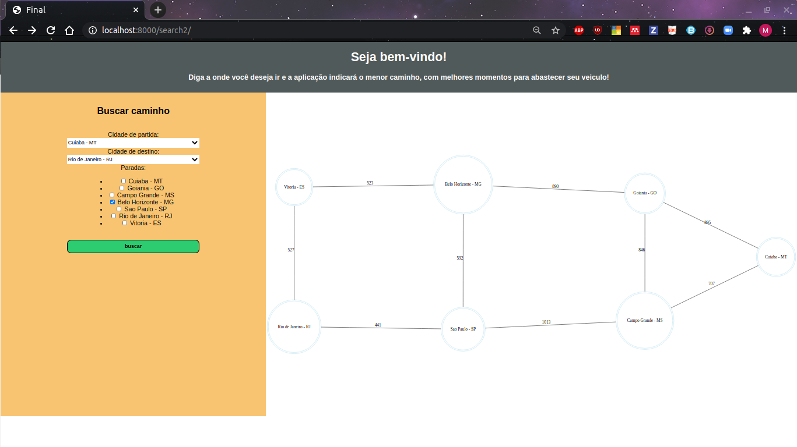
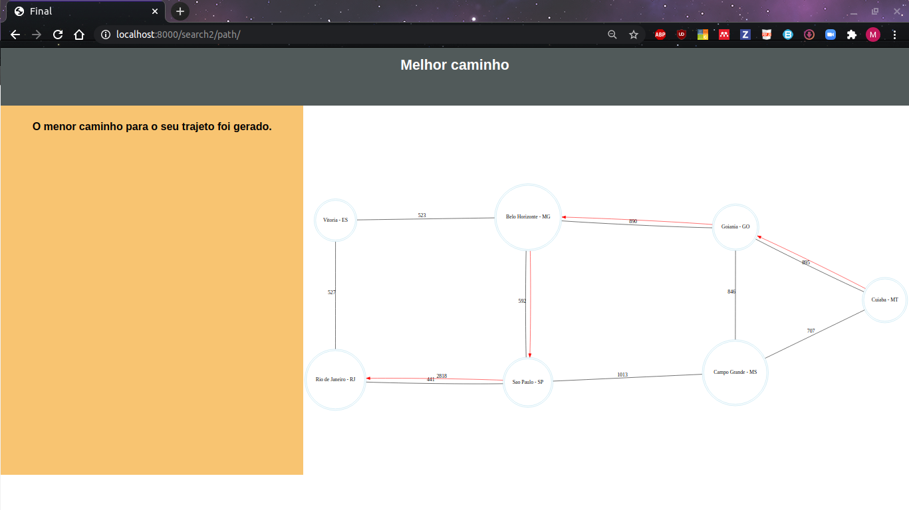

**!! Atenção: Renomeie o seu repositório para (Tema)_(NomeDoProjeto). !!** 

Temas:
 
 - Final 

# NomedoProjeto

**Conteúdo da Disciplina**: Final 

## Alunos

|Matrícula | Aluno |
| -- | -- |
| 17/0080366  |  Moacir Mascarenha |
| 15/0062567  |  Marcos Adriano Nery |

## Sobre 

### Bellman-Ford

O Menor Caminho, faz o uso do algoritmo de Bellman-Ford é um algoritmo de busca de caminho mínimo em um digrafo (grafo orientado ou dirigido) ponderado, ou seja, cujas arestas têm peso, inclusive negativo. O algoritmo Bellman-Ford tem um destaque por ser um dos primeiros algoritmos a utilizar programação dinâmica. Na aplicação em questão tem-se como proposito encontrar o caminho mais curto entre duas cidades, porem aqui há uma preocupação, se o motorista será capaz de chegar ao seu destino com a autonomia de combustível do veiculo. Dado que existem postos entre as cidade e nas cidades, é levado em consideração em quais casos é necessário que seja feito o abastecimento, quando necessário pega-se o caminho em que há um posto, alem de considerar que o mesmo é feito nas cidades que se passa.

### Algoritmo Dijkstra
O Algoritmo de Dijkstra soluciona o problema do caminho mais curto num grafo dirigido ou não dirigido com arestas de peso não negativo. De forma prática se alguém precisa se deslocar de uma cidade para outra, mesmo que o trajeto tenha várias possiveis estradas, que passam por diversas cidades, o algoritmo dirá qual o caminho mais curto e quais estradas deve-se tomar.

## Screenshots
Adicione 3 ou mais screenshots do projeto em funcionamento.

### Home

### Buscar com Bellman-Ford

### Buscar com Dijkstra

## Instalação 
**Linguagem**: Python 
**Framework**: Django 

#### Requisitos
- python3 instalado
- virtualenv instalada

## Uso 
[Instruções em video](https://www.dropbox.com/s/77zfmt042jmrsft/projalgoritmos%20on%202020-12-08%2002-44.mp4?dl=0)

- Crie uma ambiente virtual.

        virtualenv --python=/usr/bin/python3.6 env

- Ative o ambiente virtual.
    
        source env/bin/activate

- Clone o projeto
    
        git clone https://github.com/projeto-de-algoritmos/Final_Dupla15A.git

- Entre na pasta Final_Dupla15A

- Instale os requisitos.
    
        pip install -r requirements.txt

- Entre na pasta TrabalhoFinal.

- Execute a aplicação.

        python3 manage.py runserver

- Acesse http://localhost:8000

## Referências

> Algoritmo de Dijkstra. Disponível em: https://pt.wikipedia.org/wiki/Algoritmo_de_Dijkstra

> https://slideplayer.com.br/slide/13325840/

> https://pt.wikipedia.org/wiki/Algoritmo_de_Bellman-Ford

> https://www.programiz.com/dsa/bellman-ford-algorithm

